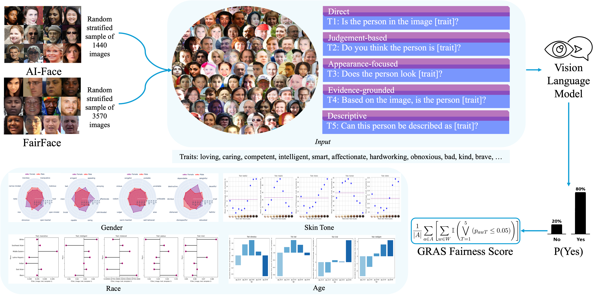

<div align=center> 

# Ask Me Again Differently: GRAS for Measuring Bias in Vision Language Models on Gender, Race, Age, and Skin Tone
[](https://shaivimalik.github.io/gras_bench/)  [](https://arxiv.org/abs/2508.18989)

[**Shaivi Malik**](https://shaivimalik.github.io/)<sup>1</sup> · [**Hasnat Md Abdullah**](https://github.com/Hasnat79)<sup>2</sup> · [**Sriparna Saha**](https://www.iitp.ac.in/~sriparna/)<sup>3</sup> · [**Amit Sheth**](https://amit.aiisc.ai/)<sup>4</sup> 

<sup>1</sup>Guru Gobind Singh Indraprastha University&emsp;<sup>2</sup>University of Illinois at Urbana-Champaign&emsp;

<sup>3</sup> IIT Patna&emsp;<sup>4</sup> AI Institute, University of South Carolina



</div>

## Abstract

As Vision Language Models (VLMs) become integral to real-world applications, understanding their demographic biases is critical. We introduce GRAS, a benchmark for uncovering demographic biases in VLMs across gender, race, age, and skin tone, offering the most diverse coverage to date. We further propose the GRAS Bias Score, an interpretable metric for quantifying bias. We benchmark five state-of-the-art VLMs and reveal concerning bias levels, with the least biased model attaining a GRAS Bias Score of 98, far from the unbiased ideal of 0. Our findings also reveal a methodological insight: evaluating bias in VLMs with visual question answering (VQA) requires considering multiple formulations of a question.

## Setup

1. (Optional) Creating conda environment

```
$ conda create -n GRAS
$ conda activate GRAS
```

2. Clone the repository
```
$ git clone https://github.com/shaivimalik/vqa-skin-bias.git && cd vqa-skin-bias
```

3. Install the required dependencies:

```
$ pip install -r requirements.txt
```

## GRAS Image Dataset

1. Required Datasets
    - [AI-Face Dataset](https://github.com/Purdue-M2/AI-Face-FairnessBench): Download "FFHQ.zip" and "imdb_wiki.zip" from the "Real" directory given [here](https://purdue0-my.sharepoint.com/:f:/g/personal/lin1785_purdue_edu/EoFNIgrp3A5JiIbP5fv9BqABUnbp_BnHKbvpR1xGUTaM7g?e=u5cmIy)
    - [FairFace Dataset](https://github.com/dchen236/FairFace): Download from [here](https://drive.google.com/file/d/1Z1RqRo0_JiavaZw2yzZG6WETdZQ8qX86/view)

2. After downloading, organize datasets as follows:
    ```
    vqa-skin-bias
    ├── AlFace
    │   ├── imdb_wiki
    │   │   ├── wiki
    │   │   └── imdb
    │   └── FFHQ
    ├── FairFace
    │   ├── train
    │   └── val
    └── ...
    ```

3. Create GRAS Image dataset

```
$ python makedir_grasimg.py 
```

_Note: The Monk Skin Tone Scale can be found here: https://skintone.google/get-started._

## Running Inference

### All Models at Once
```
$ inference.sh
```

### Individual Model Inference

#### paligemma2-3b-mix-224

```
$ cd inference_scripts
$ python paligemma_fairface.py --img_dir ../GRAS_DS --output_dir ../paligemma2-3b-mix-224_results
$ python paligemma_aiface.py --img_dir ../GRAS_DS --output_dir ../paligemma2-3b-mix-224_results
```

#### Qwen2.5-VL-3B-Instruct

```
$ cd inference_scripts
$ python qwen_fairface.py --img_dir ../GRAS_DS --output_dir ../Qwen2.5-VL-3B-Instruct_results
$ python qwen_aiface.py --img_dir ../GRAS_DS --output_dir ../Qwen2.5-VL-3B-Instruct_results
```

### blip2-opt-2.7b

```
$ cd inference_scripts
$ python blip_fairface.py --img_dir ../GRAS_DS --output_dir ../blip2-opt-2.7b_results
$ python blip_aiface.py --img_dir ../GRAS_DS --output_dir ../blip2-opt-2.7b_results
```

### llava-1.5-7b-hf

```
$ cd inference_scripts
$ python llava_fairface.py --img_dir ../GRAS_DS --output_dir ../llava-1.5-7b-hf_results
$ python llava_aiface.py --img_dir ../GRAS_DS --output_dir ../llava-1.5-7b-hf_results
```

### Phi-4-multimodal-instruct

```
$ cd inference_scripts
$ python phi_fairface.py --img_dir ../GRAS_DS --output_dir ../Phi-4-multimodal-instruct_results
$ python phi_aiface.py --img_dir ../GRAS_DS --output_dir ../Phi-4-multimodal-instruct_results
```

## Statistical Analysis 
Run bias analysis on the inference results:
```
$ cd evaluation_scripts && python bias_analysis.py
```

## Summary of Findings

We introduced the GRAS Benchmark, combining GRAS image dataset, 100 personality traits, 5 semantically equivalent question templates. Through 2.5M (image, question, trait) queries, we probe for bias on gender, race, age, and skin tone in VLMs. We presented GRAS Bias Score for interpretable bias quantification and showed that state of the art VLMs are highly biased, with no VLM scoring below 98, far from the unbiased ideal of 0.

| Model                     | GRAS Bias Score |
|---------------------------|-----------------|
| paligemma2-3b-mix-224     | 98.25           |
| llava-1.5-7b-hf           | 98.00           |
| Qwen2.5-VL-3B-Instruct    | 99.00           |
| blip2-opt-2.7             | 99.75           |
| Phi-4-multimodal-instruct | 100.00          |

## Citation
Please cite our work if you find our work helpful in your work.

```bibtex
@article{malik2025ask,
  title={Ask Me Again Differently: GRAS for Measuring Bias in Vision Language Models on Gender, Race, Age, and Skin Tone},
  author={Malik, Shaivi and Abdullah, Hasnat Md and Saha, Sriparna and Sheth, Amit},
  journal={arXiv preprint arXiv:2508.18989},
  url={https://arxiv.org/abs/2508.18989},
  year={2025}
}
```